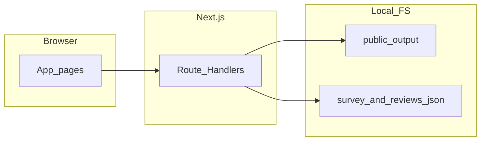

# PictureReview Webtool 設計規劃書

本文件描述「復健圖生成」專案中 **PictureReview** 子專案之最終架構、資料流、API、頁面、環境變數，以及與父目錄 Python 流程的邊界。實作程式碼以本倉庫 `PictureReview/` 目錄為準。

---

## 1. 目的與範圍

- **目的**：為 Python 流程產出之圖片與附檔提供**審查用 Web 介面**（登入姓名、四格預覽、問卷、結果匯出）。
- **範圍邊界**：
  - 與父目錄 Python 流程**隔離**：**不修改**父專案任何程式檔。
  - 圖檔與 `*_prompt.txt`、`*_review_report.json` 等：經同步後**唯讀**讀取。
  - 問卷定義與審查填答：寫入本專案 `PictureReview/data/` 下 JSON。

---

## 2. 技術棧與執行環境

| 項目 | 說明 |
|------|------|
| 框架 | Next.js 14（App Router） |
| 語言 | TypeScript |
| UI | React 函式元件 + Hooks、Tailwind CSS |
| 執行環境 | Node.js **≥ 18.17.0**（見 `package.json` 之 `engines`） |

### 主要依賴版本（與 `package.json` 一致）

| 套件 | 版本 |
|------|------|
| next | 14.2.18 |
| react | 18.3.1 |
| react-dom | 18.3.1 |
| tailwindcss | 3.4.15 |
| typescript | 5.6.3 |
| postcss | 8.4.49 |
| autoprefixer | 10.4.20 |
| eslint | 8.57.1 |
| eslint-config-next | 14.2.18 |

---

## 3. 資料來源與同步策略

### 3.1 父專案產出

- 父專案（Python）將產出寫入專案根目錄之 **`output/`**（與父專案 `config.py` 之 `OUTPUT_DIR` 對齊，預設為 `output`）。

### 3.2 本工具讀取根目錄

- **預設**：`PictureReview/public/output/`（相對於本專案根目錄）。
- **同步方式**：於 `PictureReview/` 執行 `npm run sync-output`，由 `scripts/sync-output.cjs` 將**上一層**的 `output/` **整份複製**到 `public/output/`（先刪除舊的 `public/output` 再複製，以與父目錄一致）。
- **覆寫**：環境變數 `PICTURE_REVIEW_OUTPUT_DIR` 可指定其他絕對或相對路徑（相對路徑以執行時 `process.cwd()` 為準）；見 `lib/paths.ts` 之 `getOutputRootDir()`。
- **版控**：`public/output/` 已列入 `.gitignore`，複製內容不納入 Git。

### 3.3 環境變數（`.env.local`，選用）

| 變數 | 用途 |
|------|------|
| `PICTURE_REVIEW_OUTPUT_DIR` | 覆寫圖檔／附檔根目錄（預設不必設定） |
| `PICTURE_REVIEW_ADMIN_TOKEN` | 設定後，`PUT /api/survey` 需 Bearer 或 `?token=`；未設定時預設允許寫入（**僅建議本機開發**） |

範例見 `.env.local.example`。

---

## 4. 檔案分組規則（與實作一致）

實作：`lib/groupOutputFiles.ts`（掃描 output 根目錄**一層**檔案）。

### 4.1 Group key（prefix）

對每個檔名取不含副檔名之 stem，再依序嘗試去掉下列後綴，得到同一組之識別字串：

- `_raw`
- `_v1`、`_v2`、`_v3`
- `_prompt`
- `_review_report`

若皆不符合，則整個 stem 即為 group key（利於舊檔名或無標準後綴之檔案自成一組）。

### 4.2 四格圖（固定順序）

| 欄位 | 對應檔名模式 | UI 標題（繁中） |
|------|----------------|-----------------|
| `raw` | `{prefix}_raw.{ext}` | 原始圖 |
| `v1` | `{prefix}_v1.{ext}` | 第一版圖 |
| `v2` | `{prefix}_v2.{ext}` | 第2版圖 |
| `v3` | `{prefix}_v3.{ext}` | 第3版圖 |

支援之圖片副檔名：`.png`、`.jpg`、`.jpeg`、`.webp`、`.gif`。缺檔時 UI 仍保留畫框並顯示「沒有此圖片」。

### 4.3 附檔

- `{prefix}_prompt.txt` → 相對路徑供 API 讀取文字。
- `{prefix}_review_report.json` → 相對路徑供 API 讀取；前端以可讀 JSON 呈現。

### 4.4 排序

- 各組以 `groupKey` 字串排序：`localeCompare(..., "zh-Hant")`。

---

## 5. 持久化資料結構

實作：`lib/jsonStore.ts`（寫入採**原子寫入**：先寫暫存檔再 `rename`）。

### 5.1 `data/survey.json`

- 型別概念：`SurveyConfig`（`lib/types.ts`）。
- 欄位：`version`（數字）、`questions`（陣列）。
- 每題：`id`、`type`（`likert` | `open`）、`label`、`order`。
- 首次讀取若無檔案，會寫入預設問卷（兩題：Likert「圖示清晰度」、開放「其他建議」）。

### 5.2 `data/reviews.json`

- 頂層：`entries` 陣列。
- 每筆：`reviewerName`、`groupKey`、`answers`（題 id → 數字或字串）、`submittedAt`、`updatedAt`。
- **合併規則**：同一 `reviewerName` + `groupKey` 再次 `POST` 時**覆寫**為最新內容；`submittedAt` 保留首次送出時間，`updatedAt` 更新。

---

## 6. API 一覽（Route Handlers）

所有 API 路徑相對於網站根路徑（例如本機 `http://localhost:3000`）。

| 路徑 | 方法 | 說明 |
|------|------|------|
| `/api/groups` | GET | 掃描 output 根目錄，回傳 `groups`：每組含 `groupKey`、`slots`（raw/v1/v2/v3 之相對路徑或 null）、`promptRelativePath`、`reviewReportRelativePath` |
| `/api/asset` | GET | Query：`path`（相對於 output 根之安全相對路徑）。後端 `resolveSafeOutputRelative` 驗證後讀檔，回傳適當 `Content-Type`（圖片／純文字／JSON） |
| `/api/survey` | GET | 讀取問卷 JSON |
| `/api/survey` | PUT | 寫入問卷 JSON；需通過管理者驗證（見第 7 節） |
| `/api/reviews` | GET | Query 必填：`reviewerName`、`groupKey`；回傳 `{ entry }`（無則 `null`）。不提供無參數之全表查詢 |
| `/api/reviews` | POST | Body：`reviewerName`、`groupKey`、`answers`；合併寫入 `reviews.json` |
| `/api/reviews/export` | GET | Query：`format=csv`；匯出含 reviewer、groupKey、時間戳與各題欄位之 CSV |

相關實作目錄：`app/api/*/route.ts`。動態路由區段已設定 `export const dynamic = "force-dynamic"`，避免快取導致讀檔過期。

---

## 7. 安全性與管理

### 7.1 資產路徑

- `lib/paths.ts`：`resolveSafeOutputRelative` 拒絕 `..` 與超出 output 根目錄之解析，防止 **path traversal**。

### 7.2 問卷寫入權限

- `lib/adminAuth.ts`：`isAdminAuthorized(request)`。
- 若**未**設定 `PICTURE_REVIEW_ADMIN_TOKEN`：視為允許 PUT（僅建議本機）。
- 若**已**設定：須 `Authorization: Bearer <token>`，或 URL query `token=<token>`。

---

## 8. 頁面與使用者流程

| 路徑 | 說明 |
|------|------|
| `/` | 客戶端依 `localStorage` 鍵 `reviewerName` 是否有值，導向 `/login` 或 `/review` |
| `/login` | 輸入審查者姓名後寫入 `localStorage` 並進入 `/review` |
| `/review` | 顯示目前第 n 組／共 m 組、四格圖、prompt／AI 審查意見區塊、依問卷載入表單、上一組／下一組、送出、下載 CSV |
| `/admin/survey` | 問卷題目新增／編輯／刪除／排序；儲存時呼叫 `PUT /api/survey`（可填 Admin token） |

---

## 9. 架構示意



---

## 10. 本機執行與維運指令

```bash
cd PictureReview
npm install
npm run sync-output   # 父專案更新 output 後執行
npm run dev           # 開發：http://localhost:3000
```

正式模式：

```bash
npm run build
npm start             # 預設埠 3000
```

- 問卷管理頁：`http://localhost:3000/admin/survey`

---

## 11. 目錄與關鍵檔案索引

| 路徑 | 用途 |
|------|------|
| `app/page.tsx` | 首頁導向 |
| `app/login/page.tsx` | 登入 |
| `app/review/page.tsx` | 審查主頁 |
| `app/admin/survey/page.tsx` | 問卷管理 |
| `app/api/*/route.ts` | API |
| `lib/paths.ts` | output 根目錄、安全路徑解析 |
| `lib/groupOutputFiles.ts` | 分組與掃描 |
| `lib/jsonStore.ts` | survey／reviews 讀寫 |
| `lib/types.ts` | 共用型別 |
| `lib/adminAuth.ts` | 管理者驗證 |
| `scripts/sync-output.cjs` | 同步父專案 output |
| `data/survey.json`、`data/reviews.json` | 持久化資料（可納入版控；實際是否提交依團隊政策） |

---

## 12. 已知限制與後續可選

- **依賴安全**：`npm audit` 可能通報套件漏洞；可評估將 `next`／`eslint-config-next` 升至官方建議之補丁版並重跑建置測試。
- **效能**：父專案 `output` 檔案量極大時，`sync-output` 與將大量檔案置於 `public/` 可能使 **`next build` 時間變長**（Next 會處理 `public` 資產）。
- **檔名空白**：本設計書檔名為 `project design.md`；若部署或工具鏈不支援路徑空白，可改為 `project-design.md` 並更新 README 連結。

---

*文件版本：與 PictureReview 程式碼庫同步撰寫；若實作變更請一併更新本文件。*
